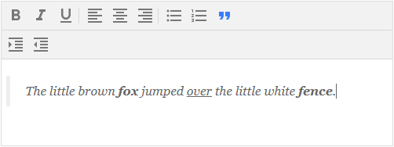

# draftjs-rich-text-editor
<p align=center>
A Rich Text Editor implementation in React using draftjs.
<p align=center><p>
</p>

## Getting started
```
npm start

or

yarn start
```

## Editing the editor
`src/rich-text-editor/RichTextEditor.tsx`

### EditorState
draft.js keeps track of the content inside the *editor* using the `editorState` object. The object should **only** be mutated inside the `RichTextEditor` component to avoid raise conditions. *Controls* mutate the `editorState` by executing the callback methods `toggleBlockType` and `toggleInlineStyle`.

### Custom key bindings
The *editor's* keybindings have been overriden by a custom `handleKeyBinding` method. An example method for keybind override has been placed in `src/utils/KeyBindingUtils.ts`. The method calls the `RichUtils.getDefaultKeyBinding(event)` method to extend the default behavior. To use the custom implementation of key bindings, change the call to `KeyBindingUtils.getDefaultKeyBinding(event)`.

A keybinding must always return either a `DraftEditorCommand` or `null`. The `switch` statement in `KeyBindingUtils.getDefaultKeyBinding` can be extended to include more key bindings.

### StyleGroup
The editor is split into two sections, *controls* and *editor*. The *controls* define the typography and style of the content inside the *editor* (**Bold**, *Italic*, lists, etc.).
All *controls* should be contained in a `StyleGroup` component.
```TSX
<StyleGroup>
  <InlineStyleControl editorState={editorState} type={{ icon: <FormatBold />, style: Style.Bold }} onToggle={toggleInlineStyle} />
  <BlockStyleControl editorState={editorState} type={{ icon: <FormatListBulleted />, style: Style.UnorderedList }} onToggle={toggleInlineStyle} />
</StyleGroup>
```

It's possible to define multiple *groups*. When doing so I recommend declaring the *controls* in an array, and mapping the TSX in a list to keep the render view clean.
```TSX
const TypographyInlineStyles: StyleType[] = [
  { icon: <FormatBold />, style: Style.Bold },
  { icon: <FormatItalic />, style: Style.Italic },
  { icon: <FormatUnderlined />, style: Style.Underline }
]

const TextAlignmentStyles: StyleType[] = [
  { icon: <FormatAlignLeft />, style: Style.AlignLeft },
  { icon: <FormatAlignCenter />, style: Style.AlignCenter },
  { icon: <FormatAlignRight />, style: Style.AlignRight }
]

const BlockStyles: StyleType[] = [
  { icon: <FormatListBulleted />, style: Style.UnorderedList },
  { icon: <FormatListNumbered />, style: Style.OrderedList },
  { icon: <FormatQuote />, style: Style.Blockquote }
]
```

```TSX
<div className={styles.styleControls}>
  <StyleGroup>
    {TypographyInlineStyles.map(type => <InlineStyleControl key={type.style} editorState={editorState} type={type} onToggle={toggleInlineStyle} />)}
  </StyleGroup>
  <StyleGroup>
    {TextAlignmentStyles.map(type => <BlockStyleControl key={type.style} editorState={editorState} type={type} onToggle={toggleBlockType} />)}
  </StyleGroup>
  <StyleGroup>
    {BlockStyles.map(type => <BlockStyleControl key={type.style} editorState={editorState} type={type} onToggle={toggleBlockType} />)}
  </StyleGroup>
</div>
```